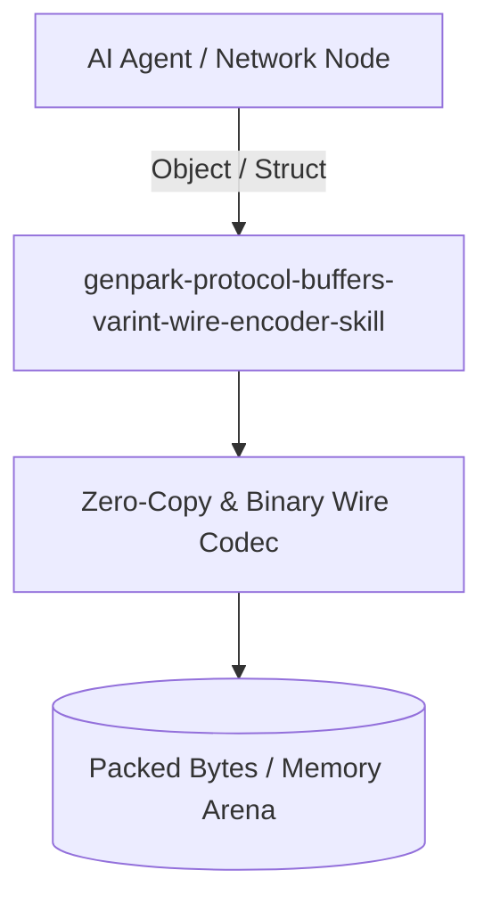

# genpark-protocol-buffers-varint-wire-encoder-skill

[](https://github.com/alphaparkinc/genpark-protocol-buffers-varint-wire-encoder-skill/actions)
[](https://opensource.org/licenses/MIT)
[](https://www.python.org/downloads/)

> Protocol Buffers (protobuf) binary wire format encoder/decoder supporting variable-length zigzag integers, wire tags, and length-delimited payloads.

## Architecture



## Features
- Pure standard library Python implementation with strictly zero pip dependencies.
- Production-grade binary serialization algorithms (Protobuf, FlatBuffers, Avro, Cap'n Proto, CBOR).
- Native Model Context Protocol (MCP) server support for AI agent payload serialization.

## Installation

```bash
git clone https://github.com/alphaparkinc/genpark-protocol-buffers-varint-wire-encoder-skill.git
cd genpark-protocol-buffers-varint-wire-encoder-skill
```

## Quickstart

```bash
python example_usage.py
```
